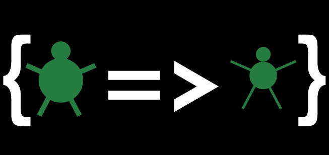

- [Welcome to CommunityFit - a stream project](#welcome-to-communityfit---a-stream-project)
  - [My Background and project inspiration](#my-background-and-project-inspiration)
    - [Hello, and welcome](#hello-and-welcome)
    - [Inspiration for the project](#inspiration-for-the-project)
      - [And so, now were here](#and-so-now-were-here)
  - [Enough jibber jabber - The Actual project](#enough-jibber-jabber---the-actual-project)
    - [Pre-requisites](#pre-requisites)
      - [Setting up a docker MySql container](#setting-up-a-docker-mysql-container)
    - [Setting up the connection string](#setting-up-the-connection-string)
      - [Full Visual Studio](#full-visual-studio)
      - [VSCode](#vscode)
      - [CLI](#cli)
    - [Building & running the project](#building--running-the-project)
      - [Visual Studio](#visual-studio)
      - [Command Line](#command-line)
    - [Goals, Tasks & Ideas](#goals-tasks--ideas)
      - [User Registration & Login](#user-registration--login)
      - [Communities](#communities)
- [Other Integrations](#other-integrations)

# Welcome to CommunityFit - a stream project 



## My Background and project inspiration

### Hello, and welcome

Hey everyone, if you're here then you have either stumbled across my recent attempts of streaming, or possibly via a tweet once I've started promoting it a little bit more.

I just wanted to briefly explain how this project came about, its purpose, its goals and what I aim to work on throughout the stream, and hopefully with the help of you, if you are so inclined.

### Inspiration for the project

So, myself and some family members aren't the skinniest of people! So around the beginning of January 2017, 4 of us decided to try a competition to motivate each other to loose a bit of 'timber'. The idea was we would each stick a few £££'s into a kitty, with the idea that whoever had lost the most weight in December would take the kitty, we would also get together once a month to 'weigh in' and take photos to see the progress we were making.

Me, being the 'techy' of the family had the thought that I would try create a website so that we could track the progress of each other, and see the various progress of weight loss and various body measurements, plotted against a graph as an percentage overall against our starting weight/measurements.

Anyway, a few months in and this fizzled out, I carried on working on the project for a bit but ultimately I had to park it and work on some other stuff.

#### And so, now were here

So, its now New Years Eve 2018, and I'm having a general browse of Twitter, I see one of people I follow on Twitter & Twitch who runs a pair programming stream (hey @csharpfritz), who mentioned that as the new year approached, he wanted to loose a little bit of weight, and to help, he requested/wanted us, his pair programmers/friends to hold him accountable and to do this via his stream. He's going to be looking at embedding some data into his stream from some smart body scales and some API's.

I had been toying with the idea of streaming for a little while after a friend had been encouraging me to do it for quite a while, I was unsure of doing it and kept on putting it off, after all I didn't feel like I felt that I knew enough to be able to do anything worth while on stream, despite securing a a Software Engineering role with my employer.

I also saw that a fellow pair programmer (hey @rgeekuk), who coincidentally is also based in the UK, give streaming a go, and I ended up thinking why don't I do it! So I bit the bullet. At the time of writing, I've only done 2 streams so far, still learning the ropes of streaming whilst problem solving, but I've had support from friends/family, and fellow streamers, including those I've specifically mentioned above.

I'm always being told I need to 'promote' myself at work more, however that isn't in my nature. I hate the thought of public speaking or doing anything up on a stage in front of a crowd, even if its only a handful of people, or even those who are somewhat younger than I am. However, the thought of being able to do something on a stage in front of people like that also excites me.

Streaming seems to be a good platform to try and hone some of these skills, in the comfort of my home, should this become a reality in the future.

I don't claim to be the best coder in the world, I am one of many self taught but if I'm able to help or inspire even at least just one person, then this has all been worth while! 😊

## Enough jibber jabber -  The Actual project

### Pre-requisites

- MYSQL (either via a Docker container  or natively installed)
- Visual Studio 2017 (or 2019) or VSCode
- .NET Core 2.2 SDK/Runtime(run `dotnet --info` or `dotnet --list-runtimes` to check your current installed versions)


#### Setting up a docker MySql container
 
 - via a powershell command prompt, run the following command
 
   `docker run --name=communityfitdb -p 3308:3306 -e MYSQL_ROOT_PASSWORD=password -e MYSQL_DATABASE=communityfitdb mysql --default-authentication-plugin=mysql_native_password`


### Setting up the connection string

I currently have the connection string for the database, for local development stored in User Secrets. The user secrets key for this project in `/aspnet-CommunityFitChallenge.Web-6E7BF479-8086-443D-A7BF-F9DED3D2D859`. More information about user secrets can be found [here](https://docs.microsoft.com/en-us/aspnet/core/security/app-secrets?view=aspnetcore-2.2&tabs=linux).

 See below on how to add 

#### Full Visual Studio

Open up the user secrets (right click on the `CommunityFitChallenge.Web project, then Manage User Secrets), and then insert the following:

```json
{
  "ConnectionStrings": {
    "CommunityFitChallenge-MySql": "server=localhost;port=3310;uid=root;database=communityfitdb;password=password"
  }
}
```

#### VSCode

The user secrets can be found at the following locations:
  |OS     |Path|
  |-------|:--------------------------------------------------------------|
  |Windows| %APPDATA%\Microsoft\UserSecrets\<user_secrets_id>\secrets.json|
  |MAC OSX| ~/.microsoft/usersecrets/<user_secrets_id>/secrets.json m     |
  |Linux  | ~/.microsoft/usersecrets/<user_secrets_id>/secrets.json       |

The user secrets ID for this project is 

#### CLI

In a terminal, navigate to the folder where CommunityFit.Web csproj is located, EG(/communityfitchallenge/CommunityFitChallenge.Web), then add 
`dotnet user-secrets set "ConnectionStrings { CommunityFitChallenge-MySql": "server=localhost;port=3310;uid=root;database=communityfitdb;password=password"`

### Building & running the project

Project can either be built via the CLI or via Visual Studio. 

#### Visual Studio 

`Ctrl + F5` Should be enough to run up an IIS instance!

#### Command Line

If this is the first time you're running, run 
`dotnet restore`
`dotnet build`
to ensure dependencies are restored.

If it isn't, then `dotnet run` should be enough to get the app running

### Goals, Tasks & Ideas

This is by no means an exhaustive list, I will add to this as and when suggestions come to me or are suggested.

#### User Registration & Login

- [ ] User details to be captured, FirstName, LastName, DOB, Email Address, Nickname
- [ ] Account confirmation (email link)
- [ ] Registered users can invite their family/friends (and if they are a community leader, can automatically approve them on sign up)
- [ ] Can control what community members can see, EG firstname / nickname would be shown by default, but user can choose to show/hide last name etc
- [ ] Body measurements and weight will be shown by default, but only as a %'age overall against their starting weight/body measurements, unless they chosen to share all
  - [ ] Where not enough data is collated to show a percentage, then a message will be displayed, and this users details won't be shown on a graph.

#### Communities

- [ ] Ability to create/join a team (aka community)
  - [ ] If its a new community, the the user setting it up automatically becomes the community leader
  - [ ] If joining a community, then an admin/leader needs to approve the request
  - [ ] Community leader can add other leaders to help with community management.
- [ ] Once a member joins the community, they can see community members details (based on their settings), but first name / nickname would always be displayed, things like last name would be shown only if that users settings allowed it


# Other Integrations

- [ ] Integrate with AppleHealth / FitBit and other to pull in health data
- [ ] Strava / other for activity data
 
